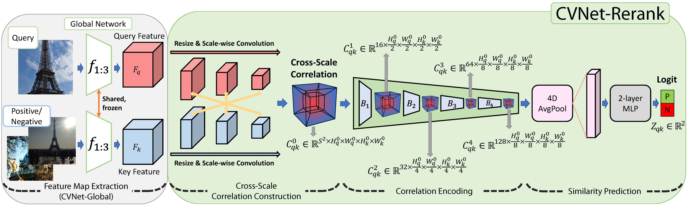

# Correlation Verification for Image Retrieval

> Official Pytorch Implementation of the paper "[**Correlation Verification for Image Retrieval**](https://openaccess.thecvf.com/content/CVPR2022/html/Lee_Correlation_Verification_for_Image_Retrieval_CVPR_2022_paper.html)"<br>
> _accept to **CVPR 2022** as an **oral presentation**_ <br>
> by Seongwon Lee, Hongje Seong, Suhyeon Lee, and Euntai Kim<br>
> Yonsei University
> 

### Overall architecture

<p align="middle">
    
</p>

## ➡️ Guide to Our Code

### Data preparation
#### Download [ROxford5k and RParis6k](https://github.com/filipradenovic/revisitop). Unzip the files and make the directory structures as follows.


```
revisitiop
 └ data
   └ datasets
     └ roxford5k
       └ gnd_roxford5k.pkl
       └ jpg
         └ ...
     └ rparis6k
       └ gnd_rparis6k.pkl
       └ jpg
         └ ...
```

### Pretrained models
You can download our pretrained models from [Google Drive](https://drive.google.com/drive/folders/1VE2uG0bynk6-XfokjE13VFNVQRb-rQM8?usp=sharing).

### Testing
For ResNet-50 model, run the command
```bash
python test.py MODEL.DEPTH 50 TEST.WEIGHTS <path-to-R50-pretrained-model> TEST.DATA_DIR <path_to_revisitop>/data/datasets
```

and for ResNet-101 model, run the command
```bash
python test.py MODEL.DEPTH 101 TEST.WEIGHTS <path-to-R101-pretrained-model> TEST.DATA_DIR <path_to_revisitop>/data/datasets
```

## 🙏 Acknowledgments
Our pytorch implementation is derived from [HSNet](https://github.com/juhongm999/hsnet), [Revisiting Oxford and Paris](https://github.com/filipradenovic/revisitop) and [DELG-pytorch](https://github.com/feymanpriv/DELG). We thank for these great works and repos.

## ✏️ Citation
If you find our paper useful in your research, please cite us using the following entry:
````BibTeX
@InProceedings{lee2022cvnet, 
    author    = {Lee, Seongwon and Seong, Hongje and Lee, Suhyeon and Kim, Euntai},
    title     = {Correlation Verification for Image Retrieval},
    booktitle = {Proceedings of the IEEE/CVF Conference on Computer Vision and Pattern Recognition (CVPR)},
    month     = {June},
    year      = {2022},
    pages     = {5374-5384}
}
````
